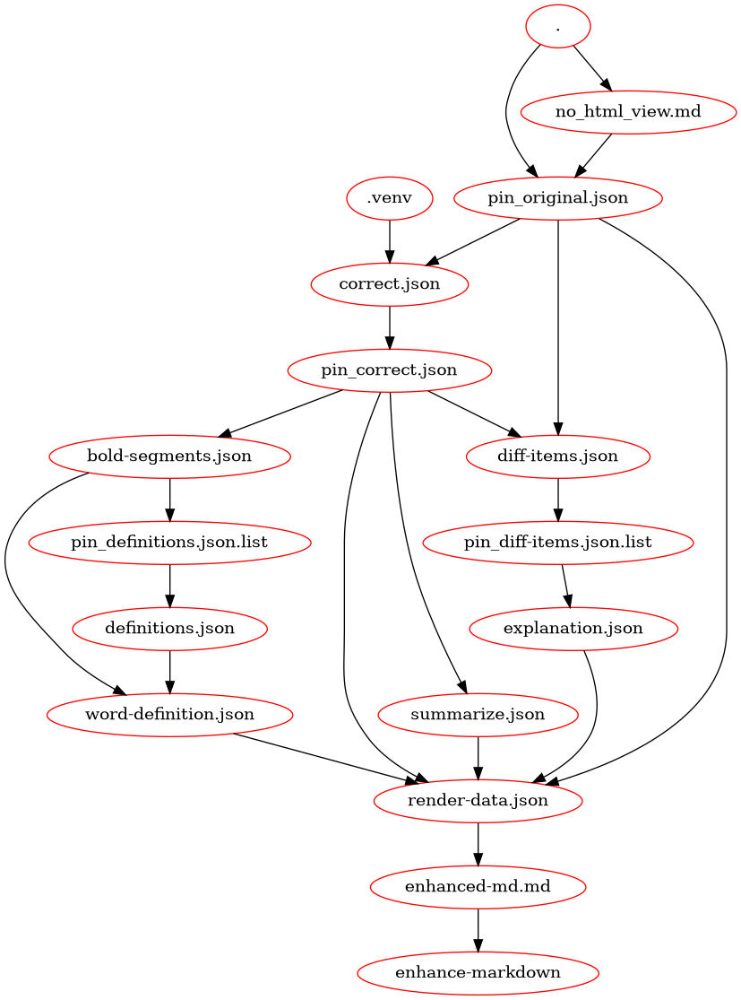

# LLM programming

The correct-markdown project is the first step of an experiment that tries to 
create a process to integrate LLM prompt processing with regular programming.

Our vision is that an application that integrates both LLM and regular programming 
should be composed of three components (or groups of components).

A. Specialized, single shot applications;  
B. LLM prompts;  
C. Makefile or similar.  

Assets produced by A and B are consumed by elements of either A or B. The Makefile 
orchestrates the asset flow, that is, who generates it and who consumes it.

For example, the correct-markdown project can be described by the following diagram.



The **pin** prefix stands for *prompt input*. A common task in the pipeline is to transform
the output of `A` (which is usually a general purpose one) into a format that is expected 
by a LLM prompt execution. We adopt json as the standard format. For example:

```bash

no_html_view.md:
	cat ${MARKDOWN_FILE} | correct-markdown markdown_view > $@

/pin_original.json: no_html_view.md
	jq --null-input --rawfile message $< '{"message":$$message}' > $@
```

## Automatic pipeline generation 

Our goal is to generate the Makefile (or input to some other tool) automatically from A and 
B. We envision a module that will process elements of A and B, accompanied by description 
documents, and then generate the pipeline file that will glue all the steps together.

The first version of correct-markdown (v0.1) has a Makefile document that was manually 
generated. The next step is to generate an equivalent document in an automatic fashion.

